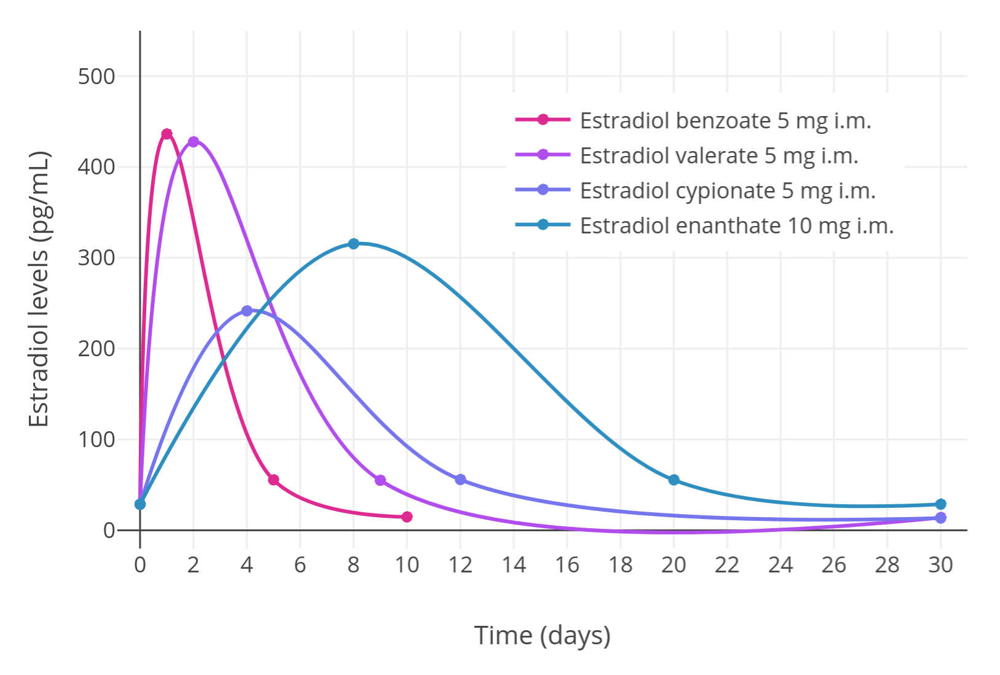
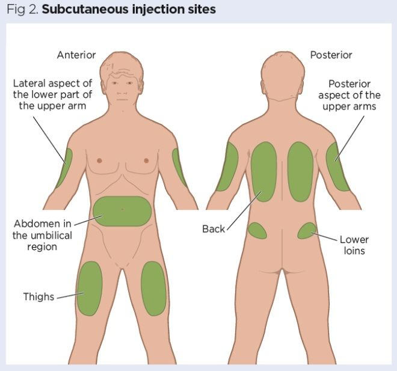
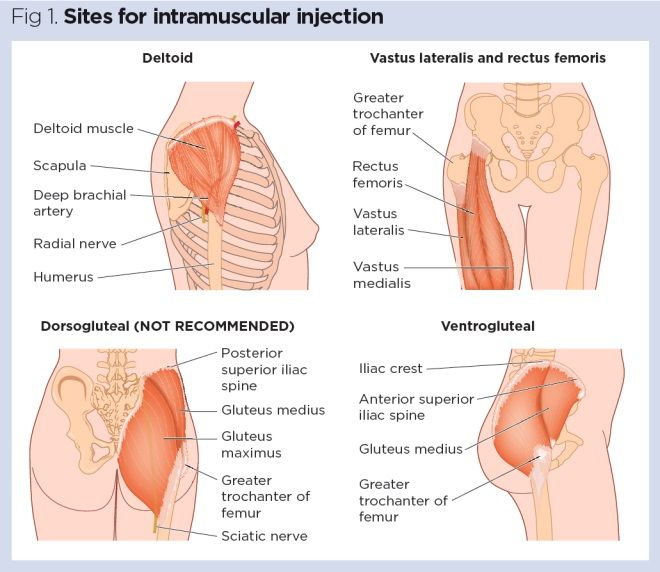
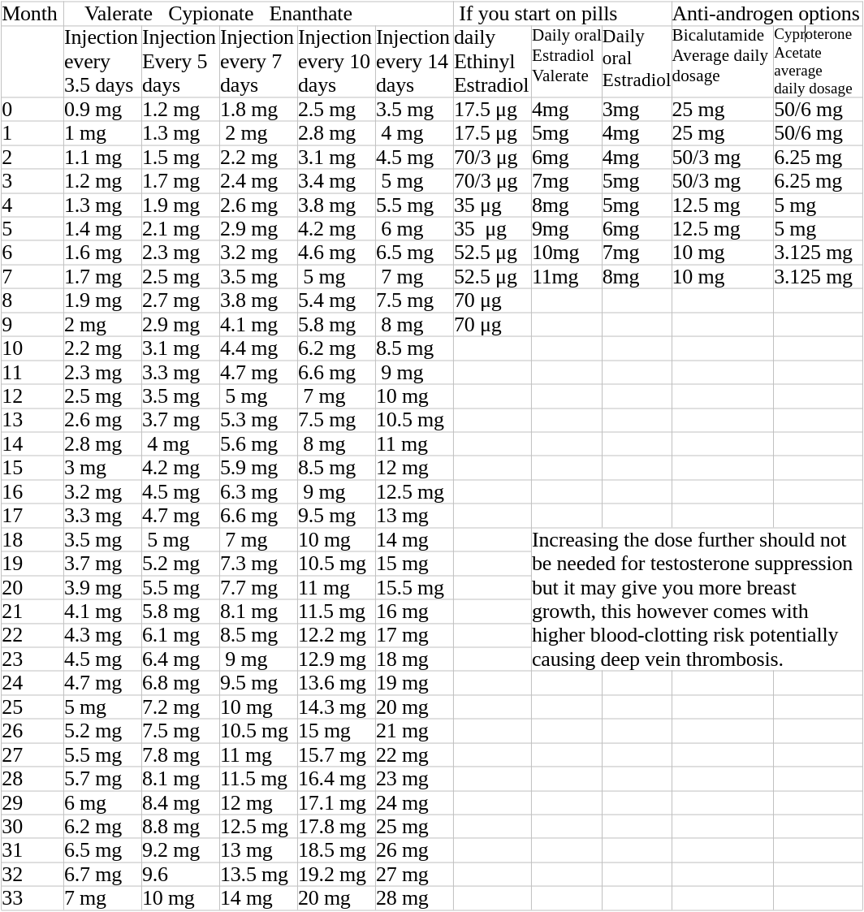
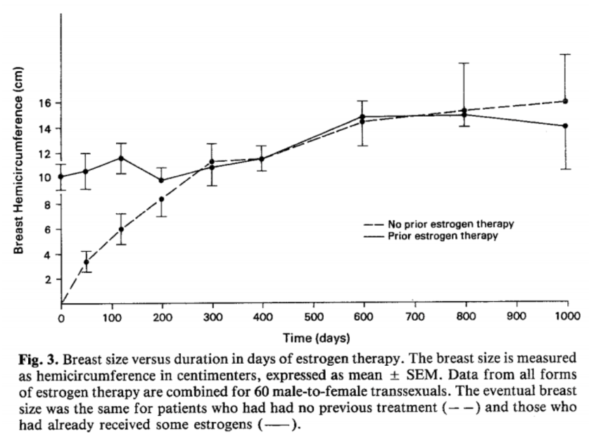

## Estradiol

Estradiol injections are the preferred method of hormone therapy for male-to-female transition, as they provide an immediate and sustained dose of the hormone. Estradiol pills and patches are less effective, but may be more convenient for some individuals looking to DIY.

## Estradiol Injections (Recommended)
Estradiol injections are a commonly used hormone therapy for male-to-female transition. Injections are the most effective way of administering estradiol, as they provide an immediate and sustained dose of the hormone. According to the World Professional Association for Transgender Health (WPATH) Standards of Care, ***injections of estradiol are the preferred method of estrogen therapy for those transitioning from male to female*** (1). Cost of injections per time period tend to be the lowest of all methods.
 

<b>Injection Methods - Estradiol Levels</b>

 

> You can do either subcutaneous or intramuscular regardless of what kind of E you have. SQ is generally less painful. For large volumes (>0.5ml) or if you get severe irritation doing SQ, consider IM. Despite what the internet tells you, absorbtion between the two is not meaningfully different, no particular site is "better", and you shouldn't use a different dose with different injection sites.

> ***Types of Needles*** 
>
> Drawing from multidose vial: 21-23G
> Drawing from single-use glass ampoule: use a filter needle
> SQ injection: 0.5" 25-31G.
> IM injection: 1-1.5" 21-27G.
>
> For needles, prefer higher gauge numbers where possible, and ideally, use a 1ml syringe.

<b>Proper Injection Sites</b>

 

## Estradiol Patches (Better)
Estradiol patches are a form of hormone therapy for male-to-female transition. Patches are applied to the skin and provide a sustained release of the hormone. While patches are less effective than injections, they are more effective than pills, and may provide a more consistent dose of estradiol (3). See [About Patches](E_PATCHES)

## Estradiol Pills (Acceptable)
Estradiol pills are another form of hormone therapy for male-to-female transition. Pills are less effective than injections, and may require higher doses to achieve the same effect. These may be more readily accessible than other methods and can be *used as a starting point* before moving to other methods that are more beneficial long-term. ***If transition progress is stalled*** switching to injections or pills may help to move beyond the plateau. Additionally, estradiol pills can be difficult to absorb and may cause gastrointestinal side effects (2). See [About Pills](E_PILLS)

{: .highlight }
> Gels and topical creams are not as effective on average, and if used application should be in the smallest surface area possible to maximize the effect.

## Reference Titration Dosages

{: .highlight }
> You may want to skip anti-androgens completely and start at the week 4 to 8 dosage. *** Monotherapy may carry the least health risks ***
>
> If you are going to use an Anti-Androgen short term low dose cypro (10mg/day or less) is probably the best option.

You can also view the reference levels at [the calculator here](https://transfemscience.org/misc/injectable-e2-simulator/)
 

## Cycling
{: .highlight }
> While some anecdotal evidence points to benefits of cycling estrogen, studies have shown that consistent estrogen administration produces better results

<b>Results of Estrogen Cycling</b>

 

## Safety
The blood clotting risk relative to the effective dosage is higher for oral administration but it's still safer
than taking birth control as cis female. 
[link](https://www.prnewswire.com/news-releases/studies-find-that-transgender-hormone-therapy-is-less-risky-than-birth-control-pills-300770439.html)

References:
1. Coleman, E., Bockting, W., Botzer, M., Cohen-Kettenis, P., DeCuypere, G., Feldman, J., & Meyer, W. (2011). Standards of care for the health of transsexual, transgender, and gender-nonconforming people, version 7. International Journal of Transgenderism, 13(4), 165-232.
2. Gooren, L. J., & Giltay, E. J. (2006). Long-term treatment of transsexuals with cross-sex hormones: extensive personal experience. Journal of Clinical Endocrinology & Metabolism, 91(2), 499-505.
3. Wierckx, K., Mueller, S., Weyers, S., Van Caenegem, E., & T'Sjoen, G. (2012). Estradiol levels achieved with different transdermal estradiol formulations in transsexual women. The Journal of Clinical Endocrinology & Metabolism, 97(7), 2434-2440.