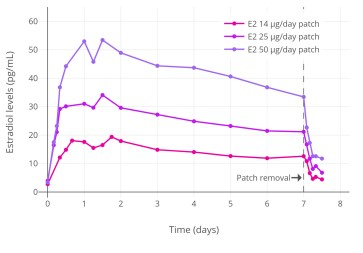

## Estradiol patches
> A general advantage with transdermal
(through the skin) administration is that while
estradiol will be absorbed the skin will act as a
protective barrier against many harmful
substances. 
> 
> From the graph to the right we see that a
50μg/day patch is equivalent to 2mg oral
estradiol/day. 
You can start on 50μg/day and then add another patch @ 25μg/day for each month

