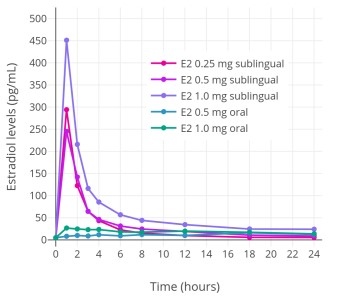

Oral estradiol (swallowing) gives stable levels but is ineffective. Sublingual estradiol is effective but will cause unstable levels.

Alternative compoundings for buccal absorption are also practical, but not widespread [such as Estradiol Gum](https://stickies.neocities.org/stickies)

## Sublingual estradiol administration
> Instead of swallowing the estradiol pills you can
let them be absorbed under the tongue, this will
bypass the liver resulting in higher effective
dosage. The issue with this is that it will result in a
sharp spike so you will have to take it every 4:th
hour to get even close to a stable estradiol blood
level.
>  
> The obvious issue is that while you can take
estradiol every 2nd hour when you are awake the
level will drop severely when you are asleep
unless you are woken up during the night (or wake
up on your own). One potential way around it is
having it slowly absorbed via buccal (in the cheek)
administration while you are sleeping.
It's simply too unpractical and it doesn't really
provide any real benefit over injections.

Taking pills orally (not buccal or sublingual) also has direct effect on liver function, and is not recommended as a primary input.

