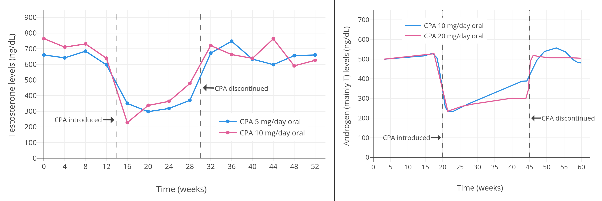

# Hormone Replacement Therapy (HRT)

{: .highlight }
> Prior to HRT be at a [healthy BMI](../passing/physical/FITNESS) - Obesity has been proven to be [higher risk for blood clot issues](https://pubmed.ncbi.nlm.nih.gov/18086925/) such as Deep Vein Thrombosis (DVT)

{: .highlight }
> Prior to HRT ensure that any health conditions that may compound with estrogen or AA administration - conditions that may affect liver or kidney function in particular

***Read the information below - Mono-estradiol is preferred in patches or injections, if testosterone suppression isn't achieved you may need an AA***

> First off you need to raise your estrogen levels, there are several options for this. A high 
estradiol dosage will by itself suppress testosterone down to within the normal female range. Many 
people do however start on lower dosage resulting in high testosterone unless anti-androgen is used. 
>
> You do not need official prescription to start on hormones in most countries, typically it's easy and safe 
to simply buy it at an online store such as [DIYHRT.cafe](https://diyhrt.cafe)

[TransFemScience](https://transfemscience.org/articles/) also hosts a wealth of information on HRT, including experimental treatments.

> Dont trust anybody that tells you the following "you are not a doctor so you dont have a right to read publicly available studies, and you dont have a right to open the dictionary and learn new words to understand the topic". That is a lie, you are a taxpayer first and you pay those scientists, they work for you in a way, so yes get into their stuff. Plus, you totally retain the human right to select a medical professional, and you do have a right to judge them, totally, absolutely yes. I do have that right.

You can expect results to begin in weeks to months - See [HRT Timeline](TIMELINE)

[Blood Testing](TESTING) is one indicator of HRT efficacy, but is not the only guidemark that should be followed.

Before you begin HRT, consider [Banking Your Sperm](BANKING) - even if you might not want to have children right now.

## DIY vs "Legit" methods

There are several ways to begin HRT

* Insurance-covered: In some countries national/social healthcare may cover costs but the time to access can be months or years and also require evaluation for dysphoria (DO NOT WAIT). Other countries have employers that will cover the cost of transitioning even surgeries like facial feminization surgery - [Starbucks](https://stories.starbucks.com/stories/2018/they-are-lifesaving-starbucks-offers-expanded-benefits-for-trans-people/) [[1](https://www.reddit.com/r/starbucks/comments/b1ook9/navigating_starbucks_healthcare_for_transgender/)], [IKEA](https://www.ikea.com/us/en/newsroom/corporate-news/ikea-u-s-launches-pride-campaign-to-push-for-greater-progress-toward-lgbtq-inclusion-pubcf8b9e77) offer even part-time positions this benefit. Consider using this to your advantage to cover costs.

* Informed Consent: There are clinics that will offer you HRT (possibly at reduced cost) in exchange for your "informed consent" - an understanding that you acknowledge the risks of the medication. US Clinics - [A post here](https://www.reddit.com/r/asktransgender/comments/d6p05q/i_compiled_every_single_informed_consent_clinic/)

* DIY: In some cases you will need to order your own through gray-market online retailers. There is a list maintained in the [Transmaxxing manifesto](https://archive.org/details/transmaxxing10), and other resources on sites such as [r/TransDIY](https://www.reddit.com/r/TransDIY/)

## Anti-Androgens (AA)
> If your testosterone is high you might benefit from an anti-androgen, this however should only be a 
temporary solution since not having enough sex-hormones (estrogen+testosterone) will be bad for your 
health and this will be worse if it is prolonged and severe. There are cheap and effective options such as
"cyproterone Acatate" (up to 12.5mg/day) and bicalutamide (up to 50mg/day).

<b>CPA Effects on Testosterone</b>

 

While Spironolactone (spiro) is used in some countries as an AA - it's weak effect and higher risks makes it unappealing as an AA. ***Use of spiro for any period of time is not recommended*** , as the effect of testosterone suppression is only viable with administration of under 4mg daily oral estradiol (which is a dosage much too low for feminization) and decreases testosterone suppression of dosages of 6mg daily oral estradiol.

[https://www.liebertpub.com/doi/epdf/10.1089/trgh.2017.0035](https://www.liebertpub.com/doi/epdf/10.1089/trgh.2017.0035)

***In general, minimizing length of use for AA is desired.***

## Estradiol

HRT typically involves taking anti-androgens to block male hormones and estrogen and progestin to induce feminine characteristics. Common physical changes from this therapy include decreased body and facial hair, decreased muscle mass, breast growth, and softer skin.

See [About Estradiol](ESTRADIOL)

## Progesterone
> You may want to take Micronized Oral Progesterone if you are not on Cyproterone Acatate. The 
current recommendation is to add progesterone after 2 to 4 years.
dosage: 200mg Sublingual (under the tongue) or rectal QHS at bedtime
https://www.ncbi.nlm.nih.gov/pmc/articles/PMC9160650/
https://academic.oup.com/jcem/article/104/4/1181/5270376

Progesterone has been shown to promote the formation of Type II lobules in breast tissue. Type II lobules have 4x the number of milk ductules, and thus more mass/volume. The hypothesis is that Type I & II lobules form under estrogen/progesterone cycles during puberty, with Type I lobules forming primarily under estrogen cycles and Type II lobules under progesterone cycles.

[https://www.ncbi.nlm.nih.gov/pmc/articles/PMC4596764/](https://www.ncbi.nlm.nih.gov/pmc/articles/PMC4596764/)

Further cycling during pregnancy with progesterone matures lobules to Type III - mature breast tissue. This tissue is also [less susceptible to breast cancers](https://www.bcpinstitute.org/brochure---reproductive-risks.html#:~:text=Type%201%2C%202%20%26%203%20lobules%20are%20differentiated,female%20hormones%2C%20estrogen%20and%20progesterone%2C%20during%20menstrual%20cycles.). Type II tissue is also significantly more resistant to cancers than immature Type I tissue.

### Cycling Progesterone

This study shows interesting data on pre-menopausal cisfemales, and how progesterone affects cell growth when used at short and long cycles.

> The present data strongly support the concept that physiologic secretion of P during a normal luteal phase favorably influences the control of the human breast epithelial cell cycle. It also suggests that P or related drugs may have a therapeutic value to prevent breast epithelial hyperplasia when used >10 days per month at approximate substitutive doses. 

[https://www.sciencedirect.com/science/article/pii/S0015028216574822?via%3Dihub](https://www.sciencedirect.com/science/article/pii/S0015028216574822?via%3Dihub)

Progesterone may be helpful for breast growth after 6 months of HRT - however further research is required on the effect with regards to transwomen

## Pioglitazone Fat Redistrubition

Thiozolidinediones have shown some initial success in speeding up fat redistribution, particularly in thighs and hips.

> She was commenced on rosiglitazone 2 mg/day and after 14 months of therapy her waist size dropped to 82.5 cms and hip measurement to 94.5 cms and at this point, her right and left thigh measurements were 45×44 cms respectively. Another 6 months of treatment on Rosiglitazone lead to drop in waist & hip measurement to 82×93 cms respectively and an increase in right and left thigh measurements to 49×47 cms respectively, which gave her a more desirable body image.

[https://www.endocrine-abstracts.org/ea/0019/ea0019p74](https://www.endocrine-abstracts.org/ea/0019/ea0019p74)