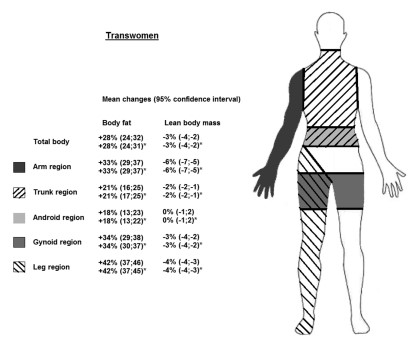

# Fitness

HRT can start changing your body to become more feminine - but feminine features are just one part of physical attractiveness for female figures. Understanding the implications of weight loss / weight gain, as well as exercising for female tone in muscle mass, can help you sculpt the figure you have wanted.

## Pre-HRT Weight Optimization

> Fat redistribution during hormone replacement therapy (HRT) for male to female transition refers to the redistribution of fat cells throughout the body. During HRT, female hormones, such as estrogen and progesterone, are introduced to the body, which can cause fat cells to shift from the abdomen, chest, and face to the hips, buttocks, and thighs. This redistribution of fat can create a more feminine silhouette and is an important part of transitioning for many transgender women.

<b>Transfeminine Fat Redistribution</b>

[1](https://eje.bioscientifica.com/configurable/content/journals$002feje$002f178$002f2$002fEJE-17-0496.xml)

***Theory / "Honscience"***

Due to lack of study on transwomen body changes while beginning HRT, there aren't peer-reviewed studies that can prove that dropping weight substantially before beginning HRT can improve outcomes such as fat redistribution or breast growth. The current reasoning is as follows:

- Losing weight is easier on testosterone - your body burns more calories and you have more strength to do more strenuous exercises
- Losing weight is harder on estrogen - your metabolism is slower (you burn less calories per same workout) and your muscle strength deteriorates
- Gaining weight in a female profile is easier when male profile fat deposits have been depleted
- Losing weight on estrogen is not the same as a change in profile; muscle tissue deterioration can result in a reduced weight without changing body profile

The major drawbacks to this method are that: 

- Strenuous exercises could in fact build male muscle mass and still require time in developing a female profile
- Breast growth is determined mostly by genetics, not weight (cis breast sizes do flucuate with weight as well, but most breast tissue is not fatty)
- The deteriment of delaying other HRT effects outweighs the possibly minimal gains with pre-HRT weight loss

## Weight Cycling

Anecdotal accounts of weight cycling do show that it could be possible to accelerate the rate of fat redistribution - however accounts of this (even well documented ones) all agree that redistribution will happen regardless of cycling.

> If you decide that weight cycling is the option for you, my best advice would be to not be too hard on yourself. Nothing you do can make you lose progress – your fat distribution will always keep shifting in the right direction, the only thing you can affect is the rate at which that happens.

[https://mesityl.substack.com/p/mtf-weight-cycling](https://mesityl.substack.com/p/mtf-weight-cycling)

## Diet / Food

Choosing the right foods for your fitness plans, goals, and body type is an important piece of the puzzle. In general you should avoid highly processed foods as well as large amounts of caffeine and alcohol. All of these can lead to digestive issues, impairment of HRT effects, or body function. 

Keep hydrated - particularly with some prescribed AAs. You may dehydrate much quicker on certain medications.

Be aware of how certain foods affect you - estrogen and other medications introduce chemical changes to your body that can affect your digestion!

## Fitness During HRT 

Some simple exercises can go a long way to help build feminine tone in muscles, and accentuate the effects of HRT in the redistribution of body fat and lowering of male muscle mass. There are 4 basic exercises that can help you get started on a fitness regimen.

1. Kegel exercises are a form of exercise designed to strengthen the pelvic floor muscles, which are the muscles that support the bladder, uterus, and rectum in women.
  
To do Kegel exercises, start by locating the pelvic floor muscles by stopping the flow of urine midstream. Once you have identified the muscles, you can contract and relax them for 10 seconds at a time, repeating this 10 times in a row. You can also do “quick flicks” where you quickly contract and relax the muscles 10 times in a row. Aim to do at least 3 sets of 10 repetitions per day. As you get more comfortable with the exercises, you can increase the number of repetitions and sets.

{: .highlight }
> For transwomen, Kegel exercises can be especially beneficial as they can help to create a more feminine pelvic shape and strengthen the muscles used in sexual activity. Additionally, they can help to increase sexual pleasure, improve sexual performance, and strengthen pelvic floor muscles. Kegel exercises can help to prevent or treat prostate problems, such as prostate enlargement and urinary incontinence.

2. Squats are a great way to work the lower body muscles, including the pelvic floor muscles. To do a squat, stand with your feet hip-width apart and your toes pointing forward. Bend your knees and lower your hips down, as if you’re sitting in a chair. Hold this position for three seconds and then stand back up. Do 10 reps.

3. Lunges are another great exercise to target the lower body muscles, including the pelvic floor muscles. To do a lunge, start in a standing position. Step one foot forward and lower your hips down until your back knee is close to the ground. Push through your front heel to stand back up. Do 10 reps on each side.

4. Plank exercises can help strengthen the core muscles, which can help support the pelvic floor muscles. To do a plank, start on your hands and knees. Then, extend your legs back one at a time and rest your weight on your toes and forearms. Hold this position for 30 seconds and then rest. Do three reps.

### Strengthening Feminine Posture
(Courtesy to [PinkFemme](https://pinkfemme.com/the-best-workouts-to-improve-elegant-feminine-posture/))

<b>Create a feminine posture by doing yoga</b>

<iframe width="640" height="360" src="https://www.youtube.com/embed/m756Gz8de4M" title="15 minute Morning Yoga for Beginners 🔥 WEIGHT LOSS edition 🔥 Beginners Yoga Workout" frameborder="0" allow="accelerometer; autoplay; clipboard-write; encrypted-media; gyroscope; picture-in-picture; web-share" allowfullscreen></iframe>

  

<b>Create a feminine posture by doing pilates</b>

 
<iframe width="640" height="360" src="https://www.youtube.com/embed/CdjRQ6GG8bA" title="Gentle Pilates - 15 Minute Pilates for Beginners Workout!" frameborder="0" allow="accelerometer; autoplay; clipboard-write; encrypted-media; gyroscope; picture-in-picture; web-share" allowfullscreen></iframe>

 

<b>Create a feminine posture by doing barre workouts</b>

 
<iframe width="640" height="360" src="https://www.youtube.com/embed/YVG06j_V_TA" title="Beginner Barre Workout - TONE UP | Rebecca Louise" frameborder="0" allow="accelerometer; autoplay; clipboard-write; encrypted-media; gyroscope; picture-in-picture; web-share" allowfullscreen></iframe>

 

<b>Create a feminine posture by doing tai chi</b>

 
<iframe width="640" height="360" src="https://www.youtube.com/embed/apIffYvzuS0" title="Tai Chi with Helen Liang" frameborder="0" allow="accelerometer; autoplay; clipboard-write; encrypted-media; gyroscope; picture-in-picture; web-share" allowfullscreen></iframe>

 

## Supplements During HRT

### Multivitamins and Preventing Osteoporosis

If you aren't on a diet that can meet all of your nutritional needs consider a multivitamin formulated for females. Vitamins such as B12 and supplements such as Collagen can help with any hair or nail fragility. Other vitamins that may help regardless of HRT could be vitamin D, particularly in northern/southern winter exposures.

Osteoporosis is a major concern when your body is not able to utilize ANY sex hormone - either testosterone or estrogen. Ensuring your levels are high enough through [appropriately dosing estrogen](../../medical/ESTRADIOL) is one factor. Ensuring enough calcium in your diet through consumption of dairy or supplementing with high calcium foods or supplemental pills is also a factor.

### Other Supplements

Some other supplements have anectodal value. One in particular is breast growth with fenugreek supplements. In historical terms this helped women with inducing or continuing lactation; today's benefit is based on individual experience and may or may not help with an increased breast growth pattern. The good news is, unless you are allergic it won't negatively affect your health or transition!
