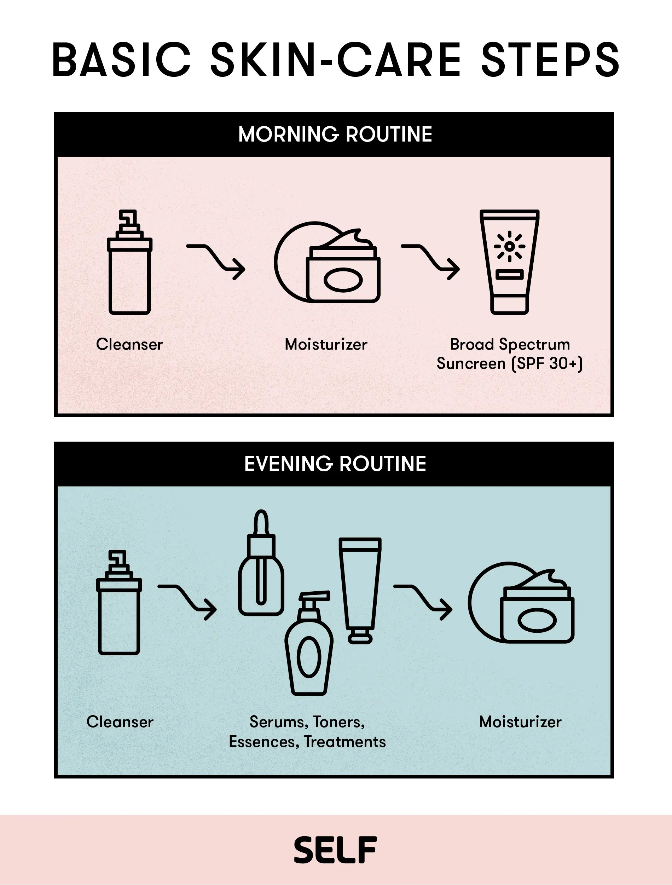

# Hygiene - a Feminine Approach

Let's get the basics out of the way - you should already be familiar with acceptable hygiene. If not, you need to start here.

After beginning HRT you will [notice changes](../../medical/TIMELINE), like softened skin, less oily skin, changes in hair growth (thickness and hair oils), and changes in body scent and pheromones. Consider using moisturizers and lotion on your body to prevent dry skin. Experiment to find the best kind for your skin!

You may also want to add feminine scents such as perfume if you want to accentuate yourself - a little goes a long way though, especially for feminine presence.

## Showers and Cleanliness

You want to look good and smell good! Showering on a regular schedule is important. Choose products that are forumulated for women's skin or have minimal or feminine scents - this can accentuate your aesthetic and won't clash with your more feminine skin and pheromones. Avoid using harsh scrubs except to exfoliate.

Use this time for self-care by adding shower steam scents or music you enjoy. It might be helpful to have shower accessories nearby or even a shower mirror.

If you intend to shave in the shower get a razer and cream developed for feminine body shaving. Don't attempt to use a regular male razer, especially if you are new to shaving other body areas! See [Hair Removal](HAIR_REMOVAL)

## Skin Care

Establishing a skin care routine will be effective to keep your skin looking healthy and youthful. It helps to remove dirt and oil that can clog pores and cause breakouts - ***skin changes with HRT can sometimes lead to dry skin an clogged pores***. It also helps to keep your skin hydrated and nourished, which can help to reduce the appearance of wrinkles and fine lines. Additionally, a skin care routine including sunblock can help to protect your skin from environmental damage, such as sun damage and pollution. It can help to boost your self-confidence, as it can make you feel more comfortable in your own skin as a more feminine appearance develops. You may need to experiment to find the right products for your skin type.

{: .highlight }
> Moisturizer and sunscreen is not just for your face!

## Hair Care

*** You will want to avoid washing your hair everday ***

You can use a dry shampoo to push wash day, or use after exercise to get a cleaner feeling and prevent oily hair.

Depending on the style you choose, your hair care routine may be different. Most transwomen opt for longer hairstyles that appear more feminine - But you can choose many other styles that might suit you. See [Hair Styling](HAIR_STYLING)

1. Wash your hair every 2-4 days with a moisturizing shampoo and conditioner. This will help keep your hair clean and healthy. Avoid shampoo/conditioner combinations, these rarely are effective and can dry out your hair.

2. Use a wide-toothed brush or comb to detangle your hair after washing. This will help prevent breakage and split ends.

3. Use a heat protectant before using any heat styling tools, such as curling irons or flat irons.

4. Deep condition your hair once a week to keep it hydrated and healthy.

5. Avoid harsh chemicals, such as bleach or hair dye, as these can damage your hair.

6. Trim your hair regularly to prevent split ends.

7. Sleep on a silk pillowcase to prevent breakage and frizz.

8. Protect your hair from the sun by wearing a hat or using a leave-in conditioner with SPF.

9. Avoid tight hairstyles, such as braids or ponytails, as these can cause breakage.

10. Eat a balanced diet - if you aren't or cannot, use a multivitamin to ensure your hair is getting all the nutrients it needs.

***Focus Shampoo on your scalp, and Conditioner on the Ends***