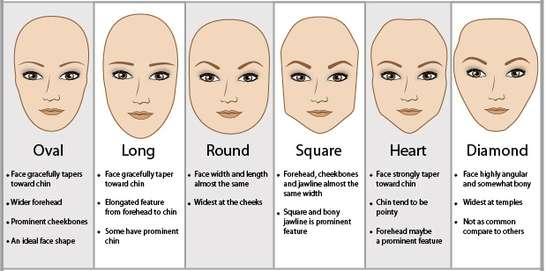
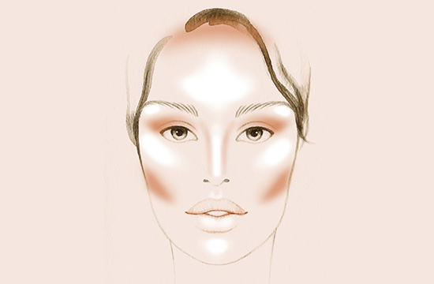

# Makeup

Makeup is a fun opportunity for expression that you can do as much (or as little) with as you want. **Before experimenting make sure you have a good makeup remover** (cleanser, wipes, or other natural method) so that mistakes can be wiped away! You don't want to make the trip of shame to the store to pick that up when you have smudged or misplaced makeup! **Get a good mirror with good lighting** - you need to see what you are doing without extra added shadow.

Consider this guide a primer - you want to seek out influencers on other platforms like YouTube or TikTok to really get a feel for how makeup can be used and applied (ha!) in your daily life.

## Mascara - The bare basics

Do you want to instantly appear more feminine? Simply apply a quality, non clumping mascara to your lashes. Be careful of less expensive, or off-brands. You will want to test this at home first - you may have some sensitivity to the brand that you choose. This makes the mascara uncomfortable for your eyes. Choose a hypo-allergenic formulation, or use falsies.

<b>Applying Mascara</b>

 
<iframe width="560" height="315" src="https://www.youtube.com/embed/Bn-TGWruo9E" title="YouTube video player" frameborder="0" allow="accelerometer; autoplay; clipboard-write; encrypted-media; gyroscope; picture-in-picture; web-share" allowfullscreen></iframe>

 

{: .highlight }
> ***False Eyelashes (Falsies)***
>
> Falsies are another way to accentuate towards a more feminine look. This is espcially helpful if your eyelashes are thinner or sparser than you'd like, or you are going for a look that your lashes just can't match in length with mascara. Cheap options are found at most value stores - you get what you pay for. Moving up in quality there are offerings such as those from [Lashify](https://www.lashify.com/), or professional aestheticians who can do applications in a salon.

## Eyeliner

> Liquid eyeliners also offer different features and advantages, so make sure to do a lot of research before deciding on a product. An ideal eyeliner would be something that’s smudge-proof and waterproof so the liner doesn’t transfer to other areas of your face.
>
> The first thing you’ll need to consider before buying a liquid eyeliner is choosing between the two main types—brush tip and felt tip.

[A Whole Article on Applying Eyeliner](https://beautymag.com/how-to-apply-liquid-eyeliner/)

There are **tons** of videos out there on how to perfect any number of techniques, including the much sought after cat-eye style!

## Eyebrows - Contouring + Lining

The next area with one of the biggest impacts is to contour and line your eyebrows. If you are starting with thick, bushy brows you need to give them a good trim! 

<b>Shaping Your Brows</b>

 
<iframe width="560" height="315" src="https://www.youtube.com/embed/-w_UgV2a54k" title="YouTube video player" frameborder="0" allow="accelerometer; autoplay; clipboard-write; encrypted-media; gyroscope; picture-in-picture; web-share" allowfullscreen></iframe>

 

There are plenty of aides on how to get the right brows for your facial shape; one way is to use tools that can provide an AI-generated representation and use it as a guide to get the correct contour. Apps such as FaceApp and websites such as [FaceShape](https://www.faceshape.com/) can guide you to something that may be close to what you want for feminine brow shape.

There are other methods for brow countouring - brow threading is a popular method that uses two thread tension to roll and remove hair.

Eyebrow lining is optional; a little goes a long way to fill in and accentuate the brow.

<b>Learn Eyebrow liner in 98 Seconds</b>

 
<iframe width="560" height="315" src="https://www.youtube.com/embed/DJYPEdCyR48" title="YouTube video player" frameborder="0" allow="accelerometer; autoplay; clipboard-write; encrypted-media; gyroscope; picture-in-picture; web-share" allowfullscreen></iframe>

 

## Foundation/Concealer

One big purpose of using a foundation or concealer is to help with hiding any facial hair shadow, especially if you have not completed any permanent form of [facial hair removal](HAIR_REMOVAL). You will want to select a liquid or cream foundation - cream foundations can be easier to work with for beginners while providing the appropriate coverage.

<b>Using Concealer to Cover Facial Hair</b>

 
<iframe width="560" height="315" src="https://www.youtube.com/embed/EOgRZBqVW3c" title="YouTube video player" frameborder="0" allow="accelerometer; autoplay; clipboard-write; encrypted-media; gyroscope; picture-in-picture; web-share" allowfullscreen></iframe>

 

### Matching Foundation to Undertones

> Its hella complicated to explain but theres 3 different types of tones:
Neutral, warm, and cool
>
> It's super important to pick blush and lip shades based on your undertone or you get a clownish look that clashes and just will not look good.

 

<b>Finding Your Skin Undertones</b>

 
<iframe width="560" height="315" src="https://www.youtube.com/embed/vu3qzFaxKDk" title="YouTube video player" frameborder="0" allow="accelerometer; autoplay; clipboard-write; encrypted-media; gyroscope; picture-in-picture; web-share" allowfullscreen></iframe>

 

<b>Choosing The Correct Foundation</b>

 
<iframe width="560" height="315" src="https://www.youtube.com/embed/IBvcDSxRPYs" title="YouTube video player" frameborder="0" allow="accelerometer; autoplay; clipboard-write; encrypted-media; gyroscope; picture-in-picture; web-share" allowfullscreen></iframe>

 

## Contouring & Highlighting

There is a basic way to contour "male" faces but its extremely customizable based on face shape age ideals of feminization.

Like a good example is a person with an extremely round face would benefit from extreme contouring  while someone with an oval, long, or square face would probably not benefit as more because it might give them a more gaunt look which can be perceived as more masculine
But at the same time the gaunt look can be seen as feminine by some if they are going for a more model-esque look.

An example of how to contour to achieve a feminizing affect is shown here:

<b>Feminizing Contouring</b>

 

 

<b>Beginner's Guide to Contouring</b>

 
<iframe width="560" height="315" src="https://www.youtube.com/embed/gkkmHizG2As" title="YouTube video player" frameborder="0" allow="accelerometer; autoplay; clipboard-write; encrypted-media; gyroscope; picture-in-picture; web-share" allowfullscreen></iframe>

 

## Lip Gloss & Lipstick

Before you even think about applying lip gloss or lip stick, have you moisturized? Lip balm and hydration keeps lips from getting chapped - and no matter the gloss or lipstick, chapped lips just won't look great, period.

### Lip Gloss
Most lip gloss is not going to last a whole day - expect to reapply after each drink, meal, or smudge. Often lip gloss is considered informal compared to lipstick.

When selecting a lip gloss, it is important to consider the shade, texture, and finish. **The shade should complement the skin tone and the overall makeup look**. The texture should be comfortable to wear, not too sticky or too thin. The finish can be shiny, sparkly, or matte, depending on personal preference. 

To apply lip gloss, start by exfoliating the lips to remove any dead skin. Then, apply a lip balm to moisturize the lips. Next, use the applicator wand to apply the lip gloss to the center of the lips and blend it outwards. Repeat the process until the desired level of shine and coverage is achieved. To prevent the lip gloss from smudging or bleeding, use a lip liner to outline the lips before applying the gloss. 

### Lipstick
There are many kinds of lipsticks, including some that won't transfer to your wine glass, napkins, or other items where you might not want lipstick. Of course traditional lipsticks that do all of the above still exist also.

When selecting a lipstick, it is important to consider your skin tone, the occasion, and the desired look. If you have fair skin, it is recommended to choose lighter shades of pink, peach, or nude, while darker skin tones can opt for bold and vibrant colors like red, plum, or berry. For a casual look, you can choose a sheer or glossy finish, while a matte finish is perfect for a more formal occasion. 

To apply lipstick, start by exfoliating your lips to remove any dry or flaky skin. Next, apply a lip balm to moisturize and prep your lips. Use a lip liner to outline your lips and prevent the lipstick from bleeding. Choose a lipstick shade that complements your skin tone and apply it evenly starting from the center of your lips and moving outward. For a more precise application, use a lip brush. Blot your lips with a tissue and reapply the lipstick for a longer-lasting finish. Finally, clean up any mistakes with a cotton swab dipped in makeup remover. 

## Blush

Selecting and applying makeup blush can be a tricky task if you don't know how to do it correctly. First, you need to choose the right shade of blush that will complement your skin tone. If you have fair skin, go for lighter shades of pink or peach, while darker skin tones look great with deeper shades of pink or mauve. Once you have selected the right shade, it's time to apply it.

<b>Applying Blush to the Right Place</b>

 
<iframe width="560" height="315" src="https://www.youtube.com/embed/BdcRNqQkNbg" title="YouTube video player" frameborder="0" allow="accelerometer; autoplay; clipboard-write; encrypted-media; gyroscope; picture-in-picture; web-share" allowfullscreen></iframe>

 

There are great products on the market for easier application, especially for transwomen. [Half Magic](https://halfmagicbeauty.com/products/cheek-fluff?variant=42404992581809) makes several hybrid products, which makes blushes much easier to work with.