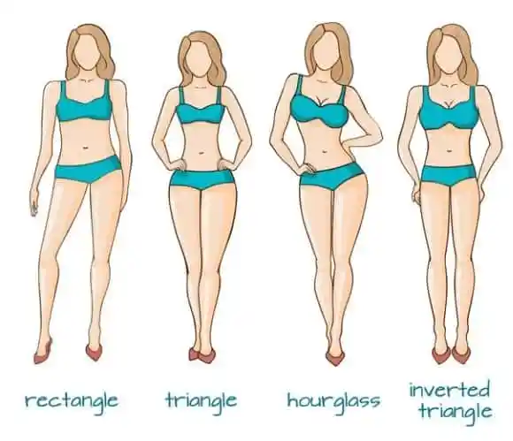

# Wardrobe

Transitioning from the drab world of guy cloths to the way more exciting and beautiful world of feminine cloths can be daunting! Here's some tips below, but also check out some amazing resources from [Pinkfemme](https://pinkfemme.com/category/style-and-fashion/) - they've compiled an incredible list of different styles and suitability for those pursuing a feminine transition. Some pages and content are linked here, but more is available at their site. Like it or not, some things just might not suit our body type - you will need to try it out and see what works for you. Think of this as part of the fun of femininity!

{: .highlight }
> To keep your clothes looking newer, longer be sure to pay special attention to the wash cycle. For textured clothes or fluffy clothes (and a lot of synthetics) you may want to avoid the dryer completely. Bras should always be air dried. [Mesh bags](https://www.amazon.com/Laundry-Hosiery-Stocking-Underwear-Lingerie/dp/B017NEYOQQ/) are inexpensive and can be used along with the delicate cycle to wash *some* handwash items

## Early Transition

As you start HRT you will have fat redistribution, and as you approach your [body goals](FITNESS) things might not end up the same fit for you even a few months down the line.

{: .highlight }
> Don't buy too many clothes during this period. As your waist and hip size changes from a male ratio to female, clothes just won't fit you the same

On a secondary note, women's clothing has an incredible variety of colors, textures, and patterns that aren't usually available in men's clothing. You can be overwhelemed at the choices and may make decisions on clothes that might not have lasting value. These clothes can be satisfying to buy in the moment or to wear once, but might not become a part of your everyday attire.

{: .highlight }
> Your style might change as you discover feminine style. Keep options open and question long term style goals to develop your own [Aesthetic](AESTHETICS)

But what if you have a large collection of men's clothes? Well good news! Most men's clothing can be repurposed or upcycled into distinct feminine looks. T-shirts in particular can be simply cut to give feminine flair.

{: .highlight }
> Style old boy cloths in a feminine fashion. T-shirts and jeans can be cut to make cute outfits with a semi-boyish fit!

<iframe width="560" height="315" src="https://www.youtube.com/embed/YLkYStVgBSA" title="YouTube video player" frameborder="0" allow="accelerometer; autoplay; clipboard-write; encrypted-media; gyroscope; picture-in-picture; web-share" allowfullscreen></iframe>

 

You can also style guy jeans by adding feminine flair such as strappy heels or sandals and a tucked in white or pastel t-shirt. [Boyfriend Jeans](https://pinkfemme.com/tips-and-tricks-to-make-boyfriend-jeans-look-feminine/)

### General Feminine Fashion Tips

Paraphrased from the [Transfemme Field Guide](https://docs.google.com/document/d/1YfsLNDa3L6IQD2R39RcrXyYnbT_sAN7TJOR8eE6lL1Y/)

{: .highlight }
> Start out at Goodwill, the cheapest of the cheap, and work your way up as you learn what does and does not work for you. If you know any women at all, even your own mother, don't be afraid to ask if they've got any hand-me-downs for you either. Experimentation is absolutely *essential* when you're building up a new wardrobe, and experimentation is expensive.

> These are soft rules, they can be toyed with and experimented around, or even broken completely, but if you want to play it safe, following these rules will make for a good outfit 100% of the time. First off, do *not* wear clothes that don't fit. That may sound obvious, but realizing that I would be going from a medium in men's to an XL in women's was most definitely disheartening, and so I would constantly catch myself wearing dresses, skirts, or pants that just plain made it difficult to breathe. You always hear the old platitude "beauty is pain", well it really doesn't have to be that way. If clothes are uncomfortable, leave ‘em in the store. Whether you're an XL, or an XXL, or a triple XL, I promise you that you'll look better, and healthier in clothes that fit you properly. If you catch yourself unbuttoning your pants when nobody is around, don't wear those pants anymore. It's as simple as that.
>
> The second soft rule is all about contrast. Contrast comes in two forms. First off, if you're wearing a loose top, wear a tight bottom. If you're wearing a loose bottom, wear a tight top. You don't *have* to do that with every outfit, but you're really taking your fate into your own hands if you don't. You don't have to follow this formula for every outfit, but it's a good guideline. There's a reason that most dresses are tight on the top, and loose on the bottom.
>
>The second form of contrast is color. Light tops-dark bottoms, light bottoms-dark tops. This one's pretty self explanatory. Going all black is the main exception to this rule, but even that can be a bit much. The goal here is to look like multiple pieces are working together to make a greater whole. That's literally what it means to look "put-together".
>
> One other area where you might catch yourself feeling exposed is your chest. A *whole* lot of transfemme people have breasts that are just… far apart. That's where necklaces come in. The point is, even if you've got breasts, some tops just leave you with a wide, flat window right below your neck, and adding a simple necklace can do a lot to distract from that, and make you feel less exposed.

## Underwear & "Tucking"

You don't need to "tuck" if you don't want to. Pick underwear that can give you the support necessary and won't reveal too much, depending on your outfit. For more form fitting pants and shorts you may want a tighter cut, like panties or boyshorts.

Paraphrased from the [Transfemme Field Guide](https://docs.google.com/document/d/1YfsLNDa3L6IQD2R39RcrXyYnbT_sAN7TJOR8eE6lL1Y/)

> Contrary to what a lot of people say, you don't need special gaff underwear, or some sort of crazy body tape to tuck. Those things can certainly help, but at the end of the day, you can just get tight, secure underwear, and your tuck will be secure, and comfortable for the most part. Really, tucking isn't that uncomfortable even at first, and you get used to it surprisingly quickly. Just remember that you most definitely don't have to tuck for every outfit. One really basic thing to look out for is that if you're wearing a loose bottom, like a dress or something. Be careful when you're outdoors, walking against the wind. It can make your clothes form against your body in ways that might leave you completely exposed. Let your purse hang down in front of you, and that basically distracts any wandering eyes. It's a simple fix, it's easy and effective.

<b>A Tutorial on Tucking</b>

<iframe width="560" height="315" src="https://www.youtube.com/embed/1i9YPM05q5c" title="YouTube video player" frameborder="0" allow="accelerometer; autoplay; clipboard-write; encrypted-media; gyroscope; picture-in-picture; web-share" allowfullscreen></iframe>

 

### Bras

Paraphrased from the [Transfemme Field Guide](https://docs.google.com/document/d/1YfsLNDa3L6IQD2R39RcrXyYnbT_sAN7TJOR8eE6lL1Y/)

> Bras are… tricky. If you've got a smaller cup size, but a fully grown body, it can be a bit difficult to find something that fits. You go to a department store, and all the A or B cup bras are *way* too small to actually get around my torso. What I recommend instead, if bras are only a "once in a while" thing for you, like they are for me, is that you get a normal, smaller cup size bra that doesn't fit your torso, and get a couple of bra band extenders. They're dirt cheap, and super useful. You might also consider getting some of these strap extenders for the shoulders. If you're like me, these things just like to fall off, and so rather than pulling up my bra all the time, I usually just put some of these strap extenders on, and criss-cross my bra straps. That way, I can have them wrapped around my back, and they don't have any chance of falling off my shoulders. Bralettes are also an amazing option. They look cute even if you've got a totally flat chest, and the sizing is much looser, so unlike standard bras, you won't have to buy a new one every few months as your breasts develop.
>
> I'd imagine a lot of you want to know how to bring your breasts closer together, given that so many transfemmes have those classic "watching the flank" breasts. Well, I do have a solution for that. It's not the most comfortable thing, but it isn't so bad either, and it most definitely gets the job done. I'll tell you right now that you should probably save this little party trick for special occasions.
>
> The strapless, adhesive bra. Basically you just stick it to your breasts, and connect it. You can compliment it further by putting a normal bra on above it. This makes it dead simple to bring your boobs together, and bring out your cleavage. Now the inherent downside is that eventually the adhesive stops working so well, and you'll have to replace them. Luckily they're pretty cheap, and can be found at any old Walmart, so it's not *too* big of a problem, but again, this is more of a party trick than something you should expect to be doing every day.
>
> Ultimately though, nothing is going to be able to compete with a bra that simply fits perfectly. While there is most definitely a little bit of truth to the idea that trans women tend to have breasts that are further apart, don’t think that this means that you won’t ever find a bra that fits comfortably. All of those WalMart bras were always so uncomfortable to wear, but for practically the same price, the couple bras from a *real* clothing store have become the most comfortable garments I own, and they fit my chest perfectly, as small and far apart as my breasts are. It is 100% worth the time investment to shop around, use the dressing rooms, and get some bras that fit correctly.

> ***Sports Bras***
>
> Sports bras can be a great tool for a transitioning woman. They offer compression (which might be required if boymoding) while also encouraging support for growing breasts. Sports bras shouldn't be the only bra you own, but they might be a good first! Some can even double as a cute crop to wear for the house or gym.

## Corsets

Corsetry can help your breast and butt look bigger by moving the soft tissue on your waist - giving your waist a thinner look. Check out the guide on [Corsetry](https://pinkfemme.com/starting-out-waist-training-beginners-guide-to-corsets/) from PinkFemme.

## Fitting to Your Body Type

[PinkFemme](https://pinkfemme.com/how-to-dress-to-your-femme-body-shape/) truly has a great resource on this and summarizes the role of body shape succinctly:

> How to dress to your femme body shape? Take your measurements and learn your basic body shape. Your size or weight is irrelevant.
>
>**Inverted Triangle**: Fitted Jackets with a nipped-in waist and flared bottom.
>
>**Rectangle**: Skirts with volume-increasing details like ruffles, bows, pleats, pockets or embellishments.
>
>**Triangle**: Fit-and-flare dresses
>
>**Hourglass**: Anything that is fitted around the waist and bosoms.

 

### Broad Shoulders

Most transwomen will have a shape much like the inverted triangle - the relevant advice?

> The inverted triangle is when your shoulders or bust line is larger than your hips. In terms of numbers, you are looking at a difference of 5% or more. This is calculated by dividing your shoulder or bust measurement by your hip measurement.
>
> You are an inverted triangle if your shoulder or bust measurement is more than 5% bigger than your hip measurement.
>
> For example, if your shoulders (or bust) measure 36 inches and your hips measure 34.25 inches or smaller that will give a ratio of 1.05 or bigger.
>
>You are in good celebrity company as an inverted triangle with Cate Blanchet and Halle Berry. If you look at how they are styled you will see a theme of looks good on both of them.
>
> The signature piece that will always look great: Fitted jackets with a nipped-in waist and flared bottom.
>
> Why: The defined waist and flare over your hips will create the illusion of lower-body curves and help balance out your shoulders.

There are also other ways to make broad shoulders feminine: [PinkFemme on Broad Shoulders](https://pinkfemme.com/making-broad-shoulders-look-more-feminine/)